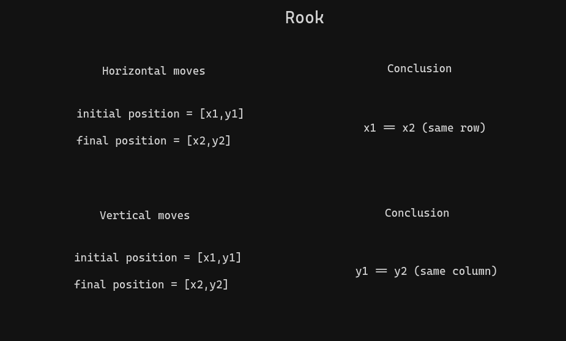
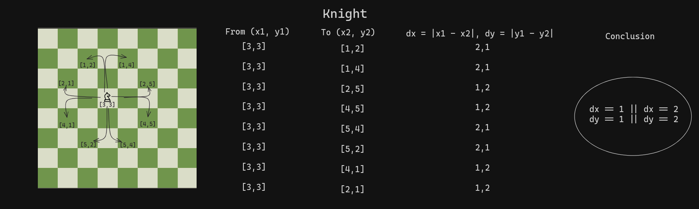
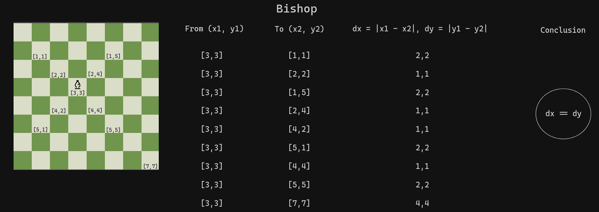
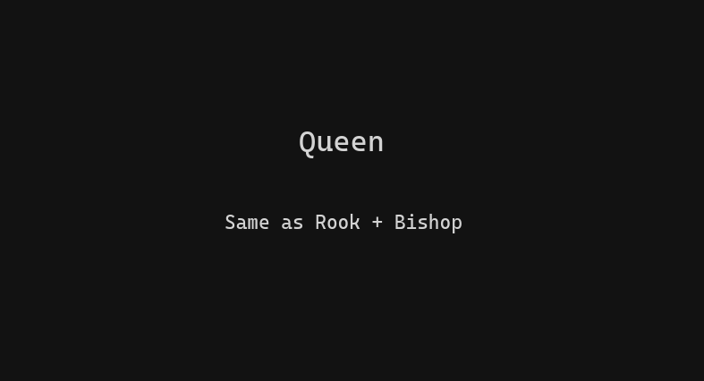

# Chess Game

Simple chess game with a GUI made with Javascript.

## How moves are calculated

## Rook

## Knight

## Bishop

## Queen

## King and Pawns

No logic required. Just move one square at a time.